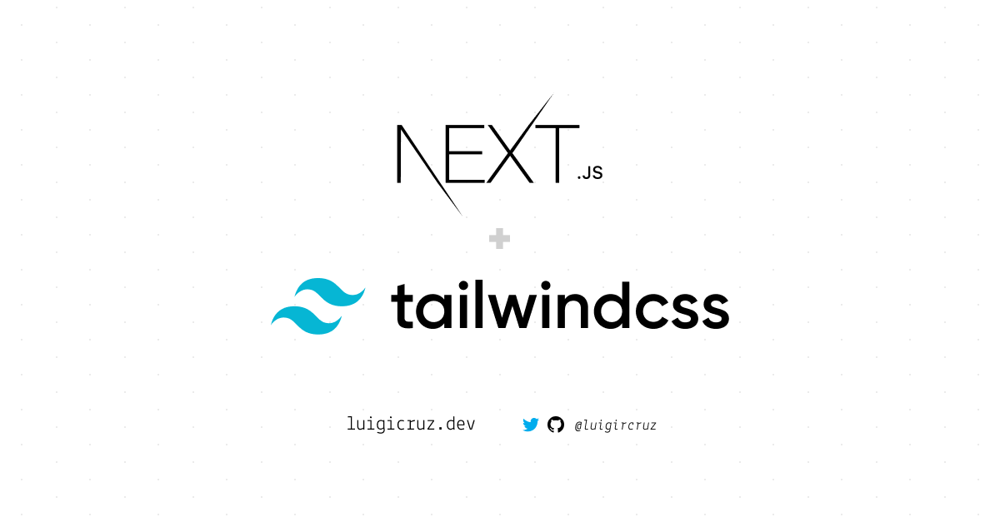

A starter preset for [NextJS](https://nextjs.org) and [TailwindCSS](https://tailwindcss.com), jumpstarting your application's development.



This preset includes [Prettier](https://prettier.io) for code formatting and I've also setup the `jsconfig.json` for package import purposes.

## Getting Started

1. First, you'll need to clone this repo. **NOTE** that you have to replace the "`project-name`" with the name of your project.

```bash
git clone https://github.com/luigircruz/next-tailwind-preset.git project-name
```

2. Change directory to your project.

```bash
cd project-name
```

3. Install the project's dependencies.

```bash
npm install
# or
yarn
```

4. Run your development server:

```bash
npm run dev
# or
yarn dev
```

5. Open http://localhost:3000 with your browser to see the result. 

And that's it! You now have a starter project with tailwind support in just 1 min.